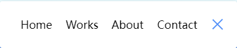

## 嵌套选择器的使用

只要求祖先元素带有该样式，不要求是直接父元素

```js
const IconLineOne = styled(IconLine)`
  .active & {
    transform: rotate(-765deg) translateY(5.5px);
  }
`
```

## 使用transform和rotate生成 X 图形



```json
const IconButton = styled.button`
  background-color: #fff;
  border: 0;
  cursor: pointer;
  padding: 0;
  position: relative;
  height: 30px;
  width: 30px;

  &:focus {
    outline: 0;
  }
`

const IconLine = styled.div`
  background-color: #5290f9;
  height: 2px;
  width: 20px;
  position: absolute;
  top: 10px;
  left: 5px;
`

const IconLineOne = styled(IconLine)`
  .active & {
    transform: rotate(-765deg) translateY(5.5px);
  }
`
const IconLineTwo = styled(IconLine)`
  top: auto;
  bottom: 10px;
  .active & {
    transform: rotate(765deg) translateY(-5.5px);
  }
`
//...

<IconButton>
    <IconLineOne></IconLineOne>
    <IconLineTwo></IconLineTwo>
</IconButton>
```

## ul只可以嵌套li

## 动画

transition 描述的是动画方式和动画时间

transform 描述的是动画的始末状态，其中rotate描述角度，translate描述距离
